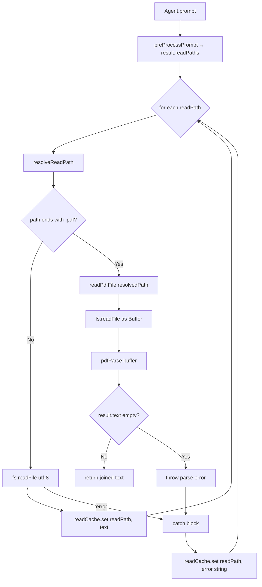
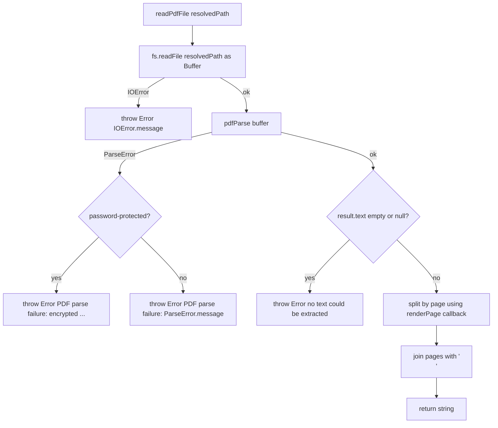

# Design Document: PDF Reading Feature

## Overview

This feature adds transparent PDF text extraction to the Edge AI study agent. Currently, the `Agent` class reads all files as plain UTF-8 strings. When a `.pdf` file is encountered, the binary content is unreadable as UTF-8. The solution introduces a `PDF_Reader` module — a single async function — that detects `.pdf` paths, extracts text via the `pdf-parse` library, and returns a `Promise<string>`. This slots directly into the existing try/catch read loop with no changes to any other part of the agent pipeline.

The goal is zero-friction integration: the rest of the agent sees only strings in the read cache, regardless of whether a file was a PDF or plain text.

## Architecture

The change is deliberately narrow. A single new module is added; the existing `agent.ts` read loop is modified in one place.



The `PDF_Reader` module lives at `src/core/pdf-reader.ts`. It is a pure function with no side effects on `Agent` state — it accepts a resolved path string and returns `Promise<string>`, leaving all cache writes to the existing call site in `agent.ts`.

## Components and Interfaces

### `src/core/pdf-reader.ts` — new module

```typescript
/**
 * Reads a PDF file from disk and extracts its full text content.
 * Each page's text is separated by a single newline character.
 *
 * @param resolvedPath - Absolute, pre-validated file path
 * @returns Promise<string> — extracted text across all pages
 * @throws Error if the file cannot be read, is password-protected,
 *         or yields zero characters of text
 */
export async function readPdfFile(resolvedPath: string): Promise<string>
```

The function is the **only** export from this module. It has no dependency on the `Agent` class or any agent state.

### `src/core/agent/agent.ts` — modified read loop

The existing loop (lines 201–211) is extended with a branch:

```typescript
for (let readPath of result.readPaths) {
    try {
        const resolvedPath = this.resolveReadPath(readPath);
        let readResult: string;

        if (readPath.toLowerCase().endsWith('.pdf')) {
            readResult = await readPdfFile(resolvedPath);
        } else {
            readResult = await fs.readFile(resolvedPath, 'utf-8');
        }

        this.readCache.set(readPath, readResult);
    } catch (error) {
        const message = error instanceof Error ? error.message : String(error);
        console.error(`Read failed for ${readPath}: ${message}`);
        this.readCache.set(readPath, `Read Failure: ${message}`);
    }
}
```

The `resolveReadPath()` call remains first, preserving the existing path-security boundary. The `catch` block is unchanged — it stores `"Read Failure: <message>"` for any thrown error, which covers access-denied, I/O failures, and PDF parse failures alike.

### PDF_Reader Internal Logic



**Page-level text extraction** is achieved via `pdf-parse`'s `pagerender` option, which invokes a callback per page. Each page's text content is collected into an array and joined with `\n` at the end.

## Data Models

No new persistent data structures are introduced. The feature operates entirely within the existing in-memory `readCache: Map<string, string>`.

### Key contract for `readCache` entries

| Scenario | Key | Value |
|---|---|---|
| Successful PDF extraction | `readPath` (original, unresolved) | Extracted text, pages joined by `\n` |
| I/O failure (any file) | `readPath` | `"Read Failure: <error message>"` |
| PDF parse failure (non-encryption) | `readPath` | `"Read Failure: PDF parse failure: <error message>"` |
| PDF parse failure (encryption) | `readPath` | `"Read Failure: PDF parse failure: encrypted or password-protected"` |
| Zero text extracted | `readPath` | `"Read Failure: PDF parse failure: no text could be extracted"` |

Note: All PDF failures propagate as thrown `Error` instances from `readPdfFile`, which are caught by the existing catch block and stored with the `"Read Failure:"` prefix — satisfying both Requirements 3.x and 4.3.

### Dependency

One new pinned runtime dependency is added to `package.json`:

```json
"pdf-parse": "1.1.1"
```

Type definitions are available as a dev dependency:

```json
"@types/pdf-parse": "1.1.4"
```

The `pdfParse` function signature (from `@types/pdf-parse`):

```typescript
declare function PdfParse(
  dataBuffer: Buffer,
  options?: PdfParse.Options
): Promise<PdfParse.Result>;

interface Result {
  text: string;       // full concatenated text
  numpages: number;
  info: object;
  // ...
}
```

## Correctness Properties

*A property is a characteristic or behavior that should hold true across all valid executions of a system — essentially, a formal statement about what the system should do. Properties serve as the bridge between human-readable specifications and machine-verifiable correctness guarantees.*

### Property 1: PDF extension detection is case-insensitive

*For any* string path, the extension detection logic SHALL return `true` if and only if the path ends with `.pdf`, `.PDF`, `.Pdf`, or any other case variant of those four characters.

**Validates: Requirements 1.1**

---

### Property 2: Multi-page text is joined by newlines

*For any* mock PDF buffer whose per-page text contents are known in advance, the output of `readPdfFile` SHALL equal those page texts joined by a single `\n` character.

**Validates: Requirements 2.2**

---

### Property 3: Cache round-trip preserves extracted text

*For any* valid PDF path and its extracted text string, after the read loop processes that path the Read_Cache SHALL contain the extracted text under the exact original `readPath` key.

**Validates: Requirements 2.3, 4.2**

---

### Property 4: Read failure error strings preserve the error message

*For any* I/O error message thrown by `fs.readFile`, the value stored in the Read_Cache under the failing path SHALL be the string `"Read Failure: "` concatenated with that exact error message.

**Validates: Requirements 3.1, 4.3**

---

### Property 5: Parse failure error strings preserve the error message

*For any* error message thrown by `pdfParse` (non-encryption), the value stored in the Read_Cache SHALL be the string `"Read Failure: PDF parse failure: "` concatenated with that exact error message.

**Validates: Requirements 3.2**

---

### Property 6: Loop continues after PDF failure

*For any* list of read paths where one or more paths cause `readPdfFile` to throw, all paths that appear after a failing path SHALL still be processed and their results SHALL still be written to the Read_Cache.

**Validates: Requirements 3.4**

---

### Property 7: Out-of-bounds paths never reach readPdfFile

*For any* path that causes `resolveReadPath()` to throw an access-denied error, `readPdfFile` SHALL NOT be called and the Read_Cache SHALL contain `"Read Failure: Access denied..."` under that path key.

**Validates: Requirements 5.2**

---

### Property 8: PDF_Reader does not mutate Agent state fields

*For any* invocation of `readPdfFile`, the values of `messageHistory`, `totalTokens`, and `resolvedPath` as they existed before the call SHALL be identical after the call completes (success or failure).

**Validates: Requirements 4.4**

## Error Handling

All error handling flows through the existing try/catch pattern in the Agent read loop. `readPdfFile` is responsible only for throwing descriptive `Error` instances; the Agent's catch block handles storage.

| Error condition | Who throws | Stored string |
|---|---|---|
| Path outside project directory | `resolveReadPath()` | `"Read Failure: Access denied: Path ... is outside project path ..."` |
| File not found / permission denied | `readPdfFile` (re-throws fs error) | `"Read Failure: <fs error message>"` |
| PDF library parse error | `readPdfFile` | `"Read Failure: PDF parse failure: <parse error message>"` |
| PDF is password-protected | `readPdfFile` | `"Read Failure: PDF parse failure: encrypted or password-protected"` |
| Extracted text is empty/null | `readPdfFile` | `"Read Failure: PDF parse failure: no text could be extracted"` |

**Encryption detection**: `pdf-parse` throws an error with the message containing `"encrypted"` or `"password"` for protected PDFs. `readPdfFile` inspects the caught error message and throws a normalized error accordingly.

**Zero-text handling**: After a successful `pdfParse` call, if `result.text` is empty, null, or undefined, `readPdfFile` throws rather than returning an empty string, so the error reaches the cache with a meaningful message.

## Testing Strategy

### Unit Tests (`src/core/pdf-reader.test.ts`)

Unit tests focus on the `readPdfFile` function in isolation, with `fs/promises` and `pdf-parse` mocked.

- Successful extraction returns joined page text
- Empty text result throws a parse failure error
- I/O error from `fs.readFile` propagates as thrown error
- Encrypted PDF error from `pdfParse` propagates with encryption message
- Generic parse error propagates with original message

### Integration Tests (`src/core/agent/agent.test.ts` — extending existing suite)

Integration tests exercise the full loop in `Agent.prompt` with `fs.readFile` mocked:

- PDF path in `readPaths` → `readPdfFile` is called and cache is populated
- Non-PDF path in `readPaths` → `fs.readFile('utf-8')` is called
- Mixed list (PDF + text + failing PDF) → all entries written to cache, loop does not abort
- Out-of-bounds PDF path → `readPdfFile` never called, cache contains access-denied error

### Property-Based Tests

Property-based testing is appropriate here because the core logic (extension detection, page joining, error message formatting, loop continuation) involves pure functions with large or infinite input spaces. The project uses Jest; [fast-check](https://fast-check.dev/) is the recommended property-based testing library for TypeScript/Jest projects.

**Configuration**: Each property test SHALL run a minimum of 100 iterations (`numRuns: 100` in fast-check).

**Tag format**: Each test includes a comment `// Feature: pdf-reading, Property N: <property_text>`

#### Property 1 test — Extension detection is case-insensitive

```typescript
// Feature: pdf-reading, Property 1: PDF extension detection is case-insensitive
fc.assert(fc.property(
  fc.string(),                                    // arbitrary base name
  fc.constantFrom('.pdf', '.PDF', '.Pdf', '.pDf'), // case variants
  (base, ext) => {
    expect((base + ext).toLowerCase().endsWith('.pdf')).toBe(true);
  }
), { numRuns: 100 });
```

#### Property 2 test — Multi-page text joined by newlines

```typescript
// Feature: pdf-reading, Property 2: Multi-page text is joined by newlines
fc.assert(fc.property(
  fc.array(fc.string(), { minLength: 1 }),         // array of page texts
  async (pages) => {
    mockPdfParse.mockResolvedValue({ text: pages.join('\n'), numpages: pages.length });
    const result = await readPdfFile('/mock/file.pdf');
    expect(result).toBe(pages.join('\n'));
  }
), { numRuns: 100 });
```

#### Property 3 test — Cache round-trip

```typescript
// Feature: pdf-reading, Property 3: Cache round-trip preserves extracted text
fc.assert(fc.property(
  fc.string({ minLength: 1 }),                     // arbitrary extracted text
  fc.string({ minLength: 1 }).map(s => s + '.pdf'), // arbitrary .pdf path
  async (extractedText, readPath) => {
    // mock setup, run loop, verify readCache.get(readPath) === extractedText
  }
), { numRuns: 100 });
```

#### Property 4 test — Read failure error string format

```typescript
// Feature: pdf-reading, Property 4: Read failure error strings preserve the error message
fc.assert(fc.property(
  fc.string({ minLength: 1 }),                     // arbitrary error message
  async (errorMessage) => {
    mockReadFile.mockRejectedValue(new Error(errorMessage));
    await agent.runReadLoop(['/some/file.pdf']);
    expect(readCache.get('/some/file.pdf')).toBe(`Read Failure: ${errorMessage}`);
  }
), { numRuns: 100 });
```

#### Property 5 test — Parse failure error string format

```typescript
// Feature: pdf-reading, Property 5: Parse failure error strings preserve the error message
fc.assert(fc.property(
  fc.string({ minLength: 1 }).filter(s => !s.includes('encrypt') && !s.includes('password')),
  async (errorMessage) => {
    mockPdfParse.mockRejectedValue(new Error(errorMessage));
    await agent.runReadLoop(['/some/file.pdf']);
    expect(readCache.get('/some/file.pdf')).toBe(`Read Failure: PDF parse failure: ${errorMessage}`);
  }
), { numRuns: 100 });
```

#### Property 6 test — Loop continues after failure

```typescript
// Feature: pdf-reading, Property 6: Loop continues after PDF failure
fc.assert(fc.property(
  fc.array(fc.string({ minLength: 1 }).map(s => s + '.txt'), { minLength: 1, maxLength: 5 }),
  fc.integer({ min: 0, max: 4 }),                  // position of failing PDF
  async (textPaths, failIdx) => {
    const paths = [...textPaths];
    paths.splice(failIdx, 0, 'bad.pdf');
    mockPdfParse.mockRejectedValueOnce(new Error('fail'));
    await agent.runReadLoop(paths);
    // all non-failing paths should be present in cache
    textPaths.forEach(p => expect(readCache.has(p)).toBe(true));
  }
), { numRuns: 100 });
```

#### Property 7 test — Out-of-bounds paths never reach readPdfFile

```typescript
// Feature: pdf-reading, Property 7: Out-of-bounds paths never reach readPdfFile
fc.assert(fc.property(
  fc.string({ minLength: 1 }).map(s => `/outside/${s}.pdf`), // paths that fail resolveReadPath
  async (outOfBoundsPath) => {
    // resolveReadPath throws for these paths
    await agent.runReadLoop([outOfBoundsPath]);
    expect(mockReadPdfFile).not.toHaveBeenCalled();
    expect(readCache.get(outOfBoundsPath)).toMatch(/^Read Failure:/);
  }
), { numRuns: 100 });
```

#### Property 8 test — readPdfFile does not mutate Agent state

```typescript
// Feature: pdf-reading, Property 8: PDF_Reader does not mutate Agent state fields
fc.assert(fc.property(
  fc.string({ minLength: 1 }),
  async (extractedText) => {
    const before = {
      messageHistory: [...agent.messageHistory],
      totalTokens: agent.totalTokens,
    };
    mockPdfParse.mockResolvedValue({ text: extractedText, numpages: 1 });
    await readPdfFile('/mock/file.pdf');
    expect(agent.messageHistory).toEqual(before.messageHistory);
    expect(agent.totalTokens).toBe(before.totalTokens);
  }
), { numRuns: 100 });
```
